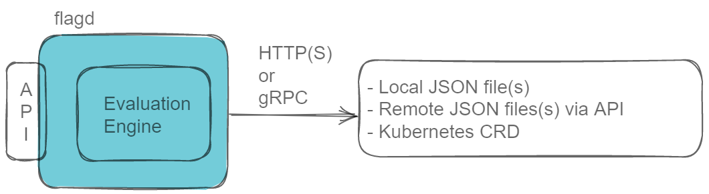

# flagd
In this tutorial, we will use [flagd](https://github.com/open-feature/flagd). So what is flagd?



flagd is a open source self-contained feature flag evaluation engine which also provides an API so that you can retrieve flag values.

flagd doesn't just read a source of feature flags and present the information to you, flagd is **active**. flagd has built in ruleset capabilities and can (if you wish) **evaluate**. This tutorial will explore these capabilities later.

flagd is a fully featured reference implementation of OpenFeature. Use it to run your feature flag system at scale or as a stepping stone to a paid-for vendor.

> If you are familiar with OpenTelemetry, flagd is Prometheus or Jaeger.

flagd is OpenFeature compliant and can read flag configurations from many sources including `files`{{}}, `http(s)`{{}} endpoints and `kubernetes Custom Resource Definitions (CRDs)`{{}}.

# How does flagd work?
flagd reads one or more feature flag source(s), interprets them and presents an OpenFeature compliant API endpoint that can be queried.

flagd is compatible with `gRPC`{{}} and `HTTP`{{}} and has native support for metrics using Prometheus. In this demo we will read flags directly from a local Git repo using `HTTPS`{{}}.

## Start flagd

Start flagd and ask it to read files from a JSON source hosted online:

```
flagd start \
  --port 8013 \
  --uri {{TRAFFIC_HOST1_3000}}/openfeature/flags/raw/branch/main/example_flags.flagd.json
```{{exec}}
