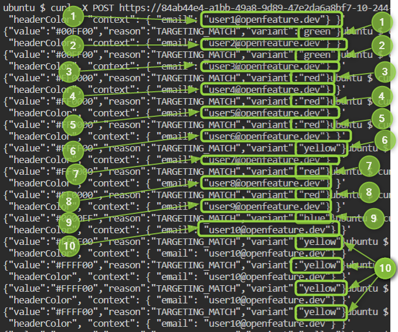

Need *even more* flexibility? Fractional evaluations allow for even more powerful flag targeting.

Look at the [headerColor]({{TRAFFIC_HOST1_3000}}/openfeature/flags/src/branch/main/flags.json#L84-L121) flag.

The available variants are `red`, `blue`, `green` and `yellow`. The `defaultVariant` should now be `yellow` (you changed it from `red` in the previous step).

So everyone receives `yellow`, right? No. There is a [targeting rule]({{TRAFFIC_HOST1_3000}}/openfeature/flags/src/branch/main/flags.json#L93-L120) which can be read like this:

If an `email` field is present during evaluation context:
- 25% of the email addresses will get `red`
- 25% of the email addresses will get `blue`
- 25% of the email addresses will get `green`
- 25% of the email addresses will get `yellow`

If an `email` field is NOT present during evaluation:
- 100% of these users get `yellow` (ie. fallback to `defaultVariant`)

### Fractional Evaluations are Sticky
The first time an `email` is evaluated, it is psuedorandomly assigned to a bucket (either `red`, `blue`, `green` or `yellow`).

Any further evaluations for the same `email` will always give the same value.

In other words, if for `user@openfeature.dev` you received `red`, `user@openfeature.dev` will always receive `red`.

`user2@openfeature.dev` can receive a different colour.

However, whatever colour `user2@openfeature.dev` receives initially (say `green`), they will continue to receive that colour.



## Experiment with Fractional Evaluations

Send this request a few times and it should always return the same colour (initially psuedo-randomly generated):

```
curl -X POST {{TRAFFIC_HOST1_8013}}/schema.v1.Service/ResolveString \
  -H "Content-Type: application/json" \
  -d '{"flagKey": "headerColor", "context": { "email": "user1@openfeature.dev" } }'
```{{exec}}

Now try with a different user. This user will probably get a different colour to `user1` but whatever they do get, they should stay with that colour:

```
curl -X POST {{TRAFFIC_HOST1_8013}}/schema.v1.Service/ResolveString \
  -H "Content-Type: application/json" \
  -d '{"flagKey": "headerColor", "context": { "email": "user2@openfeature.dev" } }'
```{{exec}}

Feel free to change the email address to experiment with the behaviour.

Finally, prove that the `defaultVariant` is working (request the flag value without providing an `email`) and returns `yellow`:

```
curl -X POST {{TRAFFIC_HOST1_8013}}/schema.v1.Service/ResolveString \
  -H "Content-Type: application/json" \
  -d '{"flagKey": "headerColor", "context": { } }'
```{{exec}}